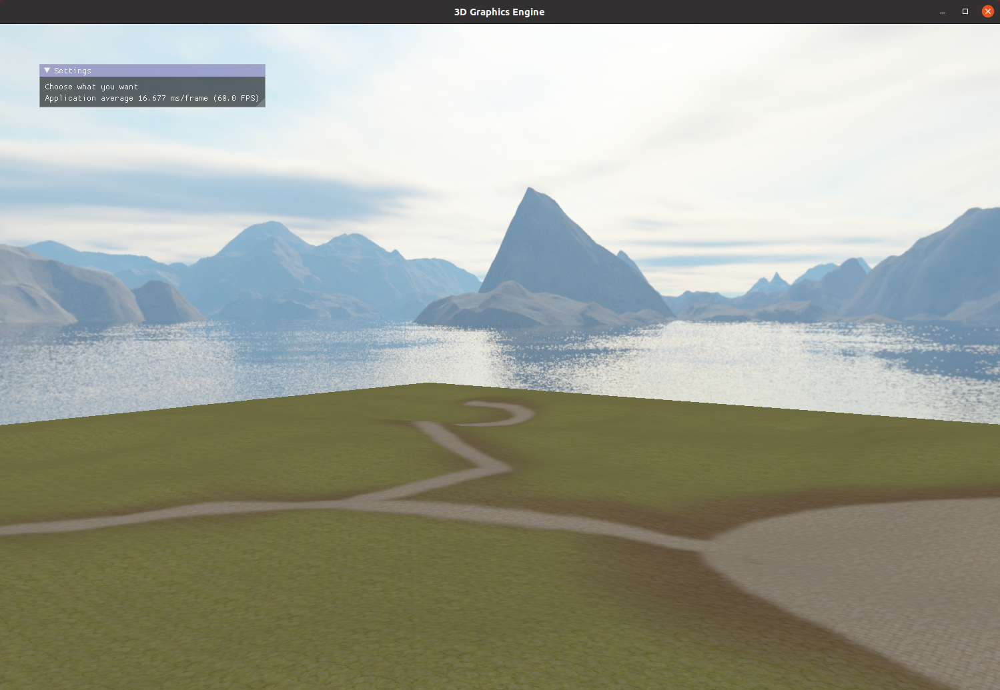

# My own opengl engine

This is a project I wrote during my high school. It's very old and the code not optimal. I plan to improve it in the future.



## Features

- camera
- light
- objects
- obj loading
- terrain
- skybox
- post processing
- imgui
- shadows

### How to install it

```bash
./install.sh
```

### How to run it

```bash
cd sources
./build.sh
```
