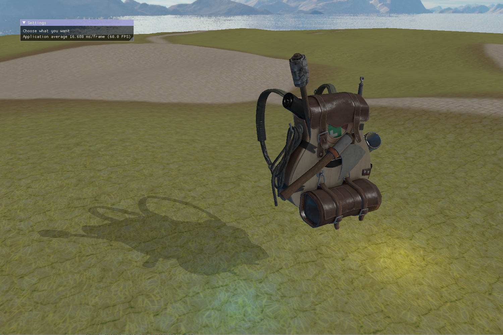

# My own opengl engine

This is an old project I did during hight school. The goal was to learn how to use OpenGL and improve my C++ skills

### Technologies used

<div align="center">


</div>


## Image of the engine


## Features

- camera
- light
- objects
- obj loading
- terrain
- skybox
- post processing
- imgui
- shadows


### How to install it

```bash
./install.sh
```

### How to run it

```bash
cd sources
./build.sh
```
